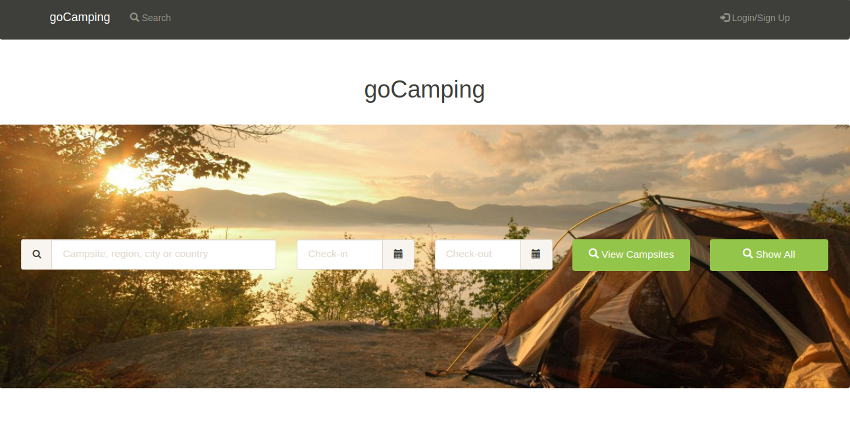
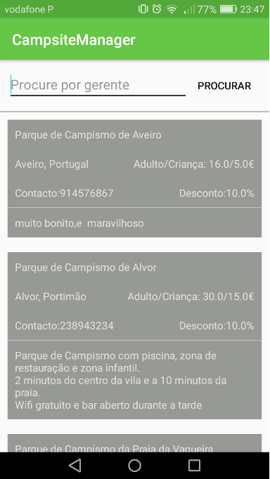
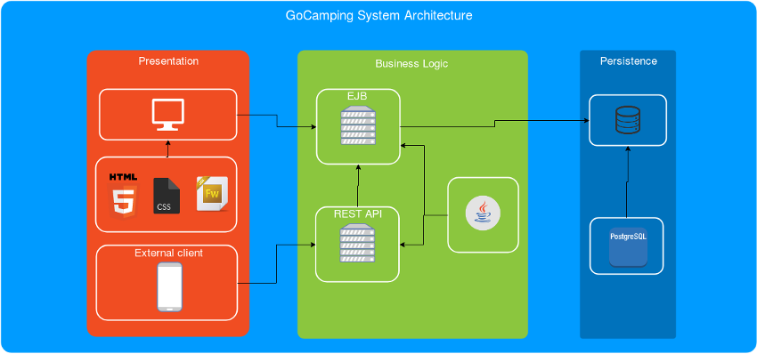
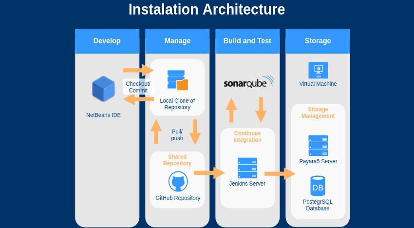

<h1 align="center">GoCamping</h1>  

Camping management system developed into Tests and Quality Assurance course

    

The system contains two clients: 
- web application to manage campsites and booking
- mobile application to consult all campsites stored into database

    

## Architecture

    

## Deployment Workflow

    

## Authors

- Andreia Patrocínio
- Carolina Albuquerque
- Diogo Jorge
- Pedro Pires
